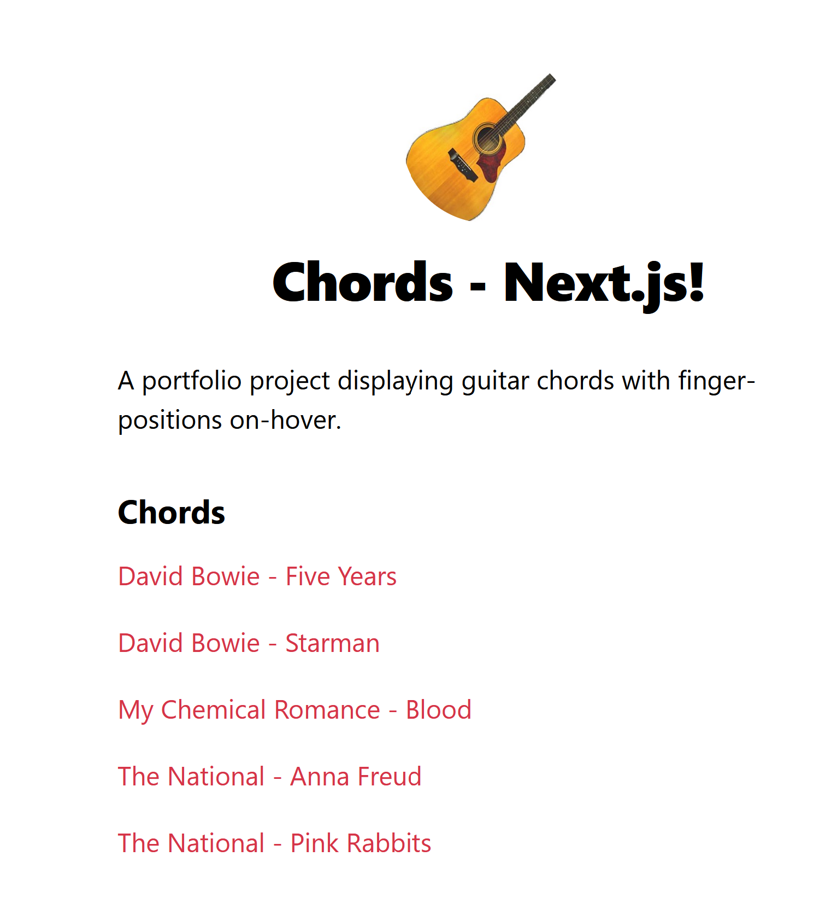

# Chords - Next.js
A portfolio project displaying guitar chords with finger-positions on-hover. Part of my Chords project - building the same site in different frameworks/with different tools.

This edition is built using [Next.js](https://nextjs.org/), "The React Framework for Production".

Making use of:
- React.js and JSX
- CSS Modules

Deployed to Vercel.

## See it in action
Visit [Chords - Next.js](https://emilkloeden.github.io/chords-eleventy/) on Vercel.
